**Git Install**
1. Navigate in your browser to [Git's Website](https://git-scm.com/download) and click the latest download for Windows. (For those using a different OS click the appropriate OS and look for the most recent stable release.)
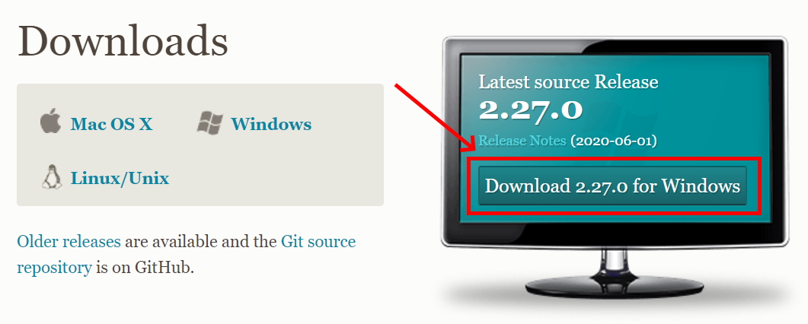 

2. Click yes to any security/firewall popup asking if you are sure you want to download the file. 

3. The install file should download; most browsers will show the file that has just downloaded, click that file. If you do so skip to step 6. If the download is not apparent on your browser go to step 4. 

4. If you were not able to click the install exe file you just downloaded in your browser open your file explorer.

5. In the window that opens click the "Downloads" folder, use the search bar in the upper right to search "git", and then double click on the Git installer exe file.

6. Click yes to any security pop-ups asking you if you want to allow the installer to make changes to your computer. 

7. The install wizard will open to guide you through the process of installing Git. Read the license agreement and click "Next." 

8. Accept the default installation path by clicking "Next."

9. Select your components. It is recommended to add a desktop icon. Leave the other boxes in their default setting. Click "Next."
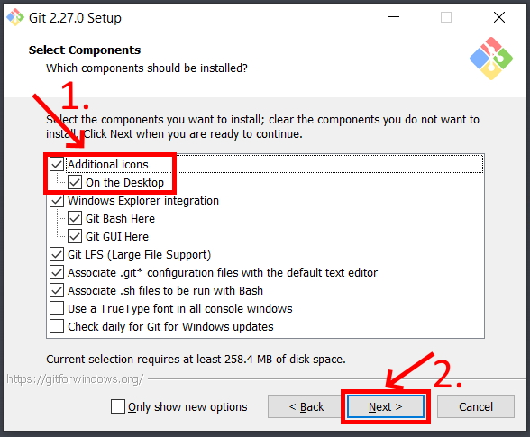

10. Leave the rest of the set up as the default configuration clicking Next until you get to the experimental options (which you should leave unchecked) and then click Install. This will run the actual install process. 

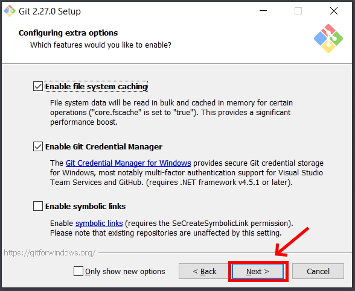

11. There should now be a Git Bash icon on your desktop. (That is, as long as you checked the box to have it create a desktop shortcut.) Double click the icon to open Git Bash. Type "git --version" and hit Enter. If it return the version of Git you installed it correctly. 
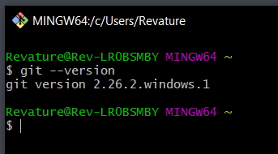

**Installing the Java 8 Development Kit(JDK)**

1. Navigate in your web browser to [Oracle's JDK 8](https://www.oracle.com/java/technologies/javase/javase-jdk8-downloads.html?) website.

2. In the top right of the website click "View Accounts" and then "Create an Account." (If you already have an Oracle account you can just skip to step 5)

3. Fill in the form with your information (you may type "none" for Company Name) and then click the "Create Account" button. 
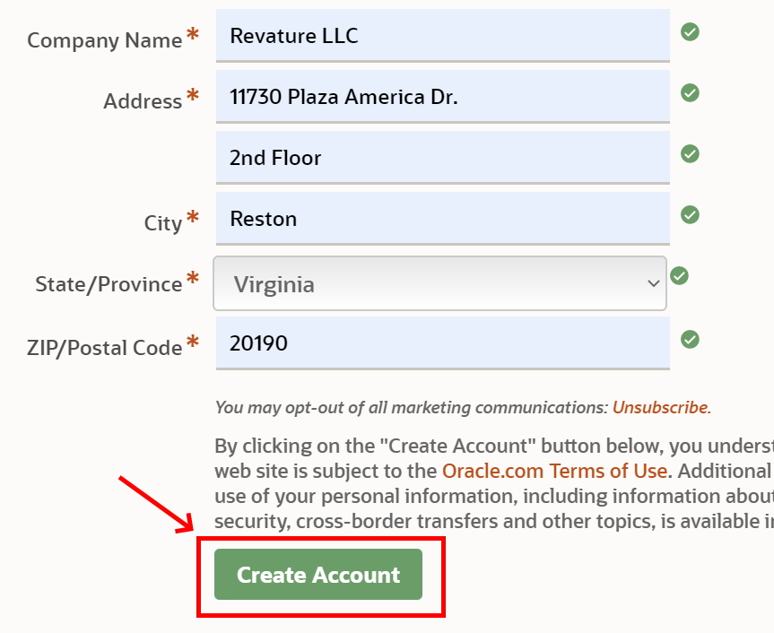

4. Check your e-mail account for a new message from Oracle. (This may take a few minutes.) When you receive the e-mail open it and click the "Verify Email Address" button inside. This should direct you to a success screen. 

5. Return to [Oracle's JDK 8](https://www.oracle.com/java/technologies/javase/javase-jdk8-downloads.html?) website. Scroll to find the appropriate JDK for your Operating System and Architecture. (Windows 10 will be Windows x64 as shown below) and click to download. 

6. A popup will ask you to review the license before continuing. Do so and click the check box and then the download button.

7. If you are not signed in a pop will appear asking you to do so. Enter your sign in information (your e-mail is your user name) and submit. The download should then begin. 

8. Click the file that downloads in your browser to open it and skip to step 11. If you do not see the file in your browser then proceed to step 9 to find it in your downloads folder. 

9. If you could not open the JDK installer from your browser open your file explorer. 

10. In the window that opens click the "Downloads" folder, search (in the top right) for "jdk" and double click the jdk installer. 

11. The installer will inform you that the license has been updated from previous versions. Review the license if you have not already and click next. 

12. The installer will continue and you should just accept the default setup. IMPORTANT: Make note of the file path for the installation directory! You WILL need this later. Click "Next."

13. The install will begin extracting files and will ask to confirm the installation directory. Make note of this directory if you did not do so in the last step. 

14. Java will finish installing and you can then click "Close."

15. Use your system search tool (next to the windows button) to look for "Edit the system environment variables" in the control panel. Be sure that you open the SYSTEM environment not the ones just for your account. 
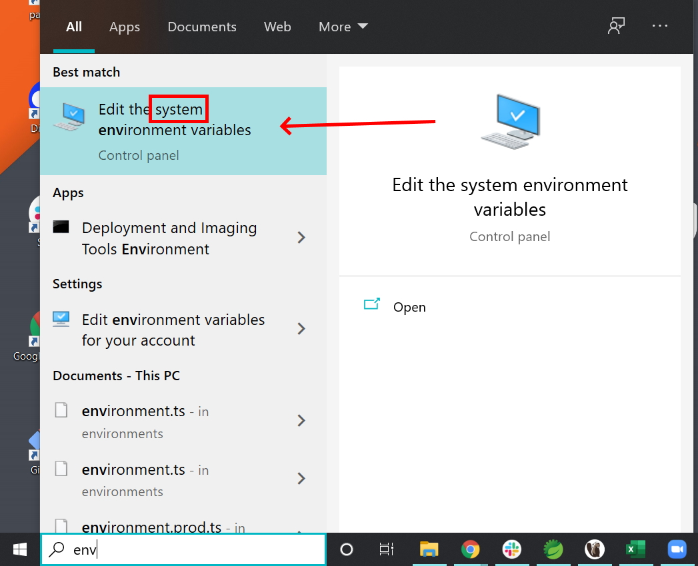

16. Click the "Environment Variables" button in the window that opens.

17. Under "System Variables" click the "New" button. 

18. Name the new variable "JAVA_HOME" and give it the value of the directory where your JDK was installed to. (See Step 12.) If you are unsure of your directory path you can go to C:\Program Files\Java in your file explorer then click on the JDK folder to open it. You can then copy the path from the navigation bar at the top of the file explorer. 
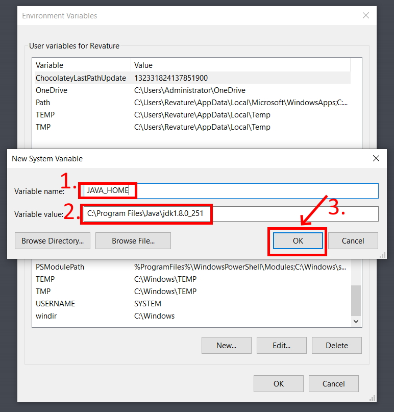

19. In your system variables then select the "Path" variable and click "Edit."
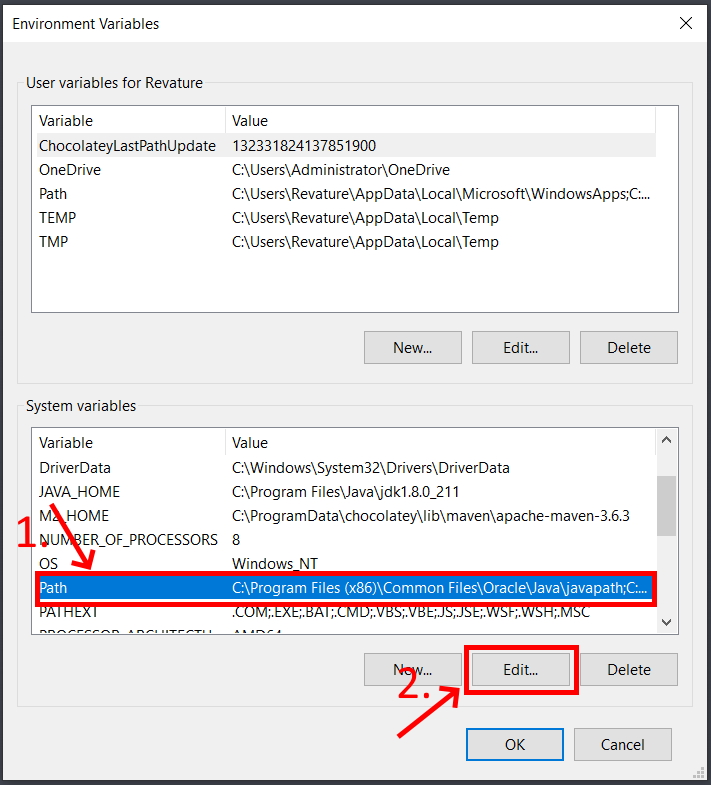

20. Click "New" to create a new line. Add the path to the JDK bin folder in this line, it will be the same as the path in JAVA_HOME with a "\bin" at the end. 

21. Click "OK" to close the Environment Variables window. 

22. Open Git Bash, type "java -version" and hit Enter. If the JDK is installed correctly you should see Java with the version number you downloaded. 
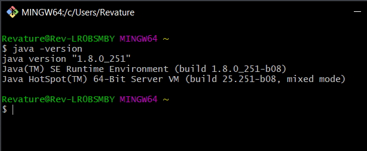

**Installing Maven**

1. Navigate in your web browser to the [Maven Download Page](https://maven.apache.org/download.cgi) and scroll down to the "Files" section. Click the Binary zip archive link to download. Approve any firewall/security popups asking if you are sure you want to download the file. 

2. The download should appear in your browser. When it completes right-click and click "Show in folder." Skip to step 4. If you were unable to right-click and show in folder proceed to step 3. 

3. If you could not open the file location from your browser, open your file explorer, click downloads, and search "maven" in the upper right search bar. You should see the file you just downloaded. 

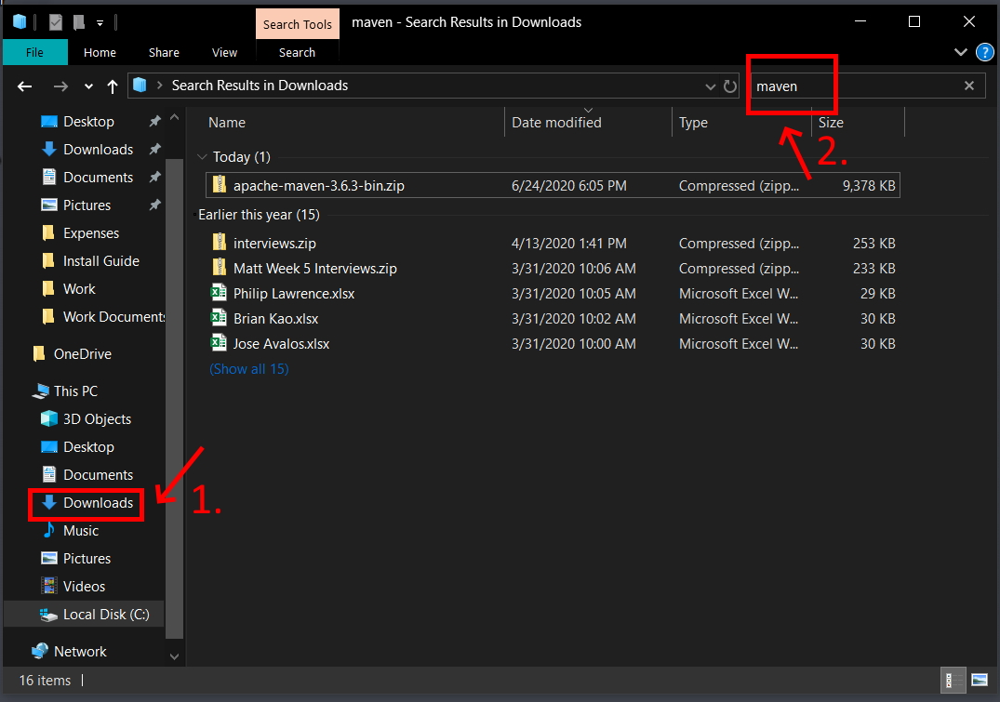

4. Right click the Maven zip archive you just downloaded and click "Extract All..."

5. Your extraction wizard will open. Set the file path to "C:\Maven" and click the box to show extracted files when complete. Then click "Extract."

6. Your file will be unzipped and your file explore will open a window to C:\Maven containing the folder with your maven version. Double click to open that folder. 
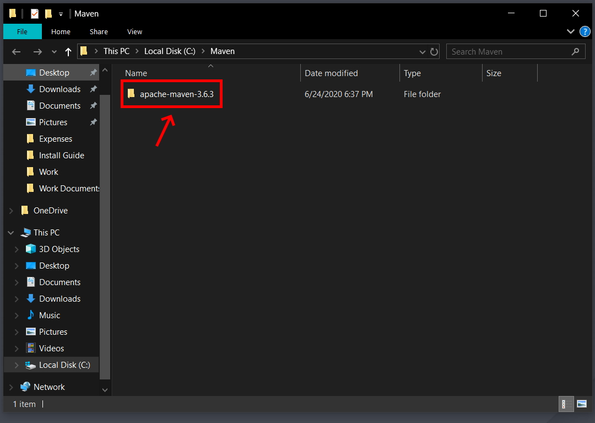

7. Now inside the versions specific folder, click the navigation bar and the top and copy the file path. You will need this for your environment variables. 

8. Use your system search tool (next to the windows button) to look for "Edit the system environment variables" in the control panel. Be sure that you open the SYSTEM environment not the ones just for your account. 

9. Click the "Environment Variables" button in the window that opens.

10. Under "System Variables" click the "New" button. 

11. Name the new variable "M2_HOME" and give it the value of the file path you copied in step 7. Then click "OK."

12. Click the new button again. Give the variable the name "M2" and the file path "%M2_HOME%\bin" then click "OK."
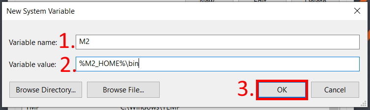

13. In your system variables then select the "Path" variable and click "Edit."

14. Click new to open a new line and type in "%M2%" then click "OK."

15. Click "OK" to close the Environment Variables window. 

16. Open Git Bash and type "mvn -v" then hit Enter. If that returns the maven version you have it set up correctly. 

**Installing Spring Tool Suite 4**

1. 

